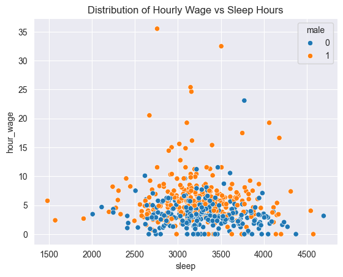

```python
import pandas as pd
import numpy as np
import seaborn as sns
import matplotlib.pyplot as plt
```


```python
df_all = pd.read_excel("sleep75.xls")
df_all
```


<div>
<style scoped>
    .dataframe tbody tr th:only-of-type {
        vertical-align: middle;
    }

    .dataframe tbody tr th {
        vertical-align: top;
    }

    .dataframe thead th {
        text-align: right;
    }
</style>
<table border="1" class="dataframe">
  <thead>
    <tr style="text-align: right;">
      <th></th>
      <th>age</th>
      <th>black</th>
      <th>case</th>
      <th>clerical</th>
      <th>construction</th>
      <th>education</th>
      <th>earnings</th>
      <th>good_health</th>
      <th>labor_force</th>
      <th>leisure_1</th>
      <th>...</th>
      <th>spouse_work</th>
      <th>total_work</th>
      <th>union</th>
      <th>work_main</th>
      <th>work_scnd</th>
      <th>expertise</th>
      <th>young_kid</th>
      <th>years_married</th>
      <th>hour_wage</th>
      <th>age_squared</th>
    </tr>
  </thead>
  <tbody>
    <tr>
      <th>0</th>
      <td>32</td>
      <td>0</td>
      <td>1</td>
      <td>0.000000</td>
      <td>0.000000</td>
      <td>12</td>
      <td>0</td>
      <td>0</td>
      <td>1</td>
      <td>3529</td>
      <td>...</td>
      <td>0</td>
      <td>3438</td>
      <td>0</td>
      <td>3438</td>
      <td>0</td>
      <td>14</td>
      <td>0</td>
      <td>13</td>
      <td>7.070004</td>
      <td>1024</td>
    </tr>
    <tr>
      <th>1</th>
      <td>31</td>
      <td>0</td>
      <td>2</td>
      <td>0.000000</td>
      <td>0.000000</td>
      <td>14</td>
      <td>9500</td>
      <td>1</td>
      <td>1</td>
      <td>2140</td>
      <td>...</td>
      <td>0</td>
      <td>5020</td>
      <td>0</td>
      <td>5020</td>
      <td>0</td>
      <td>11</td>
      <td>0</td>
      <td>0</td>
      <td>1.429999</td>
      <td>961</td>
    </tr>
    <tr>
      <th>2</th>
      <td>44</td>
      <td>0</td>
      <td>3</td>
      <td>0.000000</td>
      <td>0.000000</td>
      <td>17</td>
      <td>42500</td>
      <td>1</td>
      <td>1</td>
      <td>4595</td>
      <td>...</td>
      <td>1</td>
      <td>2815</td>
      <td>0</td>
      <td>2815</td>
      <td>0</td>
      <td>21</td>
      <td>0</td>
      <td>0</td>
      <td>20.53</td>
      <td>1936</td>
    </tr>
    <tr>
      <th>3</th>
      <td>30</td>
      <td>0</td>
      <td>4</td>
      <td>0.000000</td>
      <td>0.000000</td>
      <td>12</td>
      <td>42500</td>
      <td>1</td>
      <td>1</td>
      <td>3211</td>
      <td>...</td>
      <td>1</td>
      <td>3786</td>
      <td>0</td>
      <td>3786</td>
      <td>0</td>
      <td>12</td>
      <td>0</td>
      <td>12</td>
      <td>9.619998</td>
      <td>900</td>
    </tr>
    <tr>
      <th>4</th>
      <td>64</td>
      <td>0</td>
      <td>5</td>
      <td>0.000000</td>
      <td>0.000000</td>
      <td>14</td>
      <td>2500</td>
      <td>1</td>
      <td>1</td>
      <td>4052</td>
      <td>...</td>
      <td>1</td>
      <td>2580</td>
      <td>0</td>
      <td>2580</td>
      <td>0</td>
      <td>44</td>
      <td>0</td>
      <td>33</td>
      <td>2.75</td>
      <td>4096</td>
    </tr>
    <tr>
      <th>...</th>
      <td>...</td>
      <td>...</td>
      <td>...</td>
      <td>...</td>
      <td>...</td>
      <td>...</td>
      <td>...</td>
      <td>...</td>
      <td>...</td>
      <td>...</td>
      <td>...</td>
      <td>...</td>
      <td>...</td>
      <td>...</td>
      <td>...</td>
      <td>...</td>
      <td>...</td>
      <td>...</td>
      <td>...</td>
      <td>...</td>
      <td>...</td>
    </tr>
    <tr>
      <th>701</th>
      <td>45</td>
      <td>0</td>
      <td>702</td>
      <td>0.182331</td>
      <td>0.030075</td>
      <td>12</td>
      <td>5500</td>
      <td>1</td>
      <td>0</td>
      <td>5069</td>
      <td>...</td>
      <td>1</td>
      <td>2026</td>
      <td>0</td>
      <td>2026</td>
      <td>0</td>
      <td>27</td>
      <td>0</td>
      <td>18</td>
      <td>.</td>
      <td>2025</td>
    </tr>
    <tr>
      <th>702</th>
      <td>34</td>
      <td>0</td>
      <td>703</td>
      <td>0.182331</td>
      <td>0.030075</td>
      <td>10</td>
      <td>2500</td>
      <td>0</td>
      <td>0</td>
      <td>5885</td>
      <td>...</td>
      <td>0</td>
      <td>675</td>
      <td>1</td>
      <td>465</td>
      <td>210</td>
      <td>18</td>
      <td>0</td>
      <td>4</td>
      <td>.</td>
      <td>1156</td>
    </tr>
    <tr>
      <th>703</th>
      <td>37</td>
      <td>0</td>
      <td>704</td>
      <td>0.182331</td>
      <td>0.030075</td>
      <td>12</td>
      <td>3500</td>
      <td>1</td>
      <td>0</td>
      <td>4719</td>
      <td>...</td>
      <td>1</td>
      <td>1851</td>
      <td>0</td>
      <td>1851</td>
      <td>0</td>
      <td>19</td>
      <td>0</td>
      <td>17</td>
      <td>.</td>
      <td>1369</td>
    </tr>
    <tr>
      <th>704</th>
      <td>54</td>
      <td>0</td>
      <td>705</td>
      <td>0.182331</td>
      <td>0.030075</td>
      <td>17</td>
      <td>32500</td>
      <td>1</td>
      <td>0</td>
      <td>5149</td>
      <td>...</td>
      <td>1</td>
      <td>1961</td>
      <td>1</td>
      <td>1481</td>
      <td>480</td>
      <td>31</td>
      <td>0</td>
      <td>22</td>
      <td>.</td>
      <td>2916</td>
    </tr>
    <tr>
      <th>705</th>
      <td>30</td>
      <td>0</td>
      <td>706</td>
      <td>0.182331</td>
      <td>0.030075</td>
      <td>16</td>
      <td>6750</td>
      <td>1</td>
      <td>0</td>
      <td>4747</td>
      <td>...</td>
      <td>0</td>
      <td>2363</td>
      <td>0</td>
      <td>2363</td>
      <td>0</td>
      <td>8</td>
      <td>1</td>
      <td>9</td>
      <td>.</td>
      <td>900</td>
    </tr>
  </tbody>
</table>
<p>706 rows × 34 columns</p>
</div>


## Data Cleansing
> Type Casting


```python
type_mapping = {
    'age': np.int64,
    'black': np.int64,
    'case': np.int64,
    'clerical': np.int64,
    'construction': np.int64,
    'education': np.int64,
    'earnings': np.int64,
    'good_health': np.int64,
    'labor_force': np.int64,
    'leisure_1': np.int64,
    'leisure_2': np.int64,
    'leisure_3': np.int64,
    'smsa': np.int64,
    'lhrwage': np.float64,
    'othinc': np.float64,
    'male': np.int64,
    'married': np.int64,
    'protestant': np.int64,
    'relax_all': np.int64,
    'self_employed': np.int64,
    'sleep': np.int64,
    'sleep_naps': np.int64,
    'south': np.int64,
    'spouse_pay': np.int64,
    'spouse_work': np.int64,
    'total_work': np.int64,
    'union': np.int64,
    'work_main': np.int64,
    'work_scnd': np.int64,
    'expertise': np.int64,
    'young_kid': np.int64,
    'years_married': np.int64,
    'hour_wage': np.float64,
    'age_squared': np.int64
}
```


```python
assert not set(type_mapping.keys()).difference(set(df_all.columns)), "Not all columns are handled"
```


```python
def can_cast(value: object, type_: type) -> bool:
    try:
        type_(value)
        if (issubclass(type_, int) or issubclass(type_, np.integer)) and not np.float64(value).is_integer():
            return False  # Prevent casting float-like strings to int
        return True
    except ValueError:
        return False
```

> converting invalid data in cells to NaNs


```python
for column in df_all.columns:
    df_all[column] = df_all[column] \
    .apply(lambda x: x if can_cast(x, type_mapping[column]) else np.nan) \

df_all = df_all.astype({k: v.__name__.title() for k, v in type_mapping.items()})
```


```python
df_all[["leisure_2", "leisure_3", "sleep_naps", "total_work", "sleep"]]
```


<div>
<style scoped>
    .dataframe tbody tr th:only-of-type {
        vertical-align: middle;
    }

    .dataframe tbody tr th {
        vertical-align: top;
    }

    .dataframe thead th {
        text-align: right;
    }
</style>
<table border="1" class="dataframe">
  <thead>
    <tr style="text-align: right;">
      <th></th>
      <th>leisure_2</th>
      <th>leisure_3</th>
      <th>sleep_naps</th>
      <th>total_work</th>
      <th>sleep</th>
    </tr>
  </thead>
  <tbody>
    <tr>
      <th>0</th>
      <td>3479</td>
      <td>3479</td>
      <td>3163</td>
      <td>3438</td>
      <td>3113</td>
    </tr>
    <tr>
      <th>1</th>
      <td>2140</td>
      <td>2140</td>
      <td>2920</td>
      <td>5020</td>
      <td>2920</td>
    </tr>
    <tr>
      <th>2</th>
      <td>4505</td>
      <td>4227</td>
      <td>2760</td>
      <td>2815</td>
      <td>2670</td>
    </tr>
    <tr>
      <th>3</th>
      <td>3211</td>
      <td>3211</td>
      <td>3083</td>
      <td>3786</td>
      <td>3083</td>
    </tr>
    <tr>
      <th>4</th>
      <td>4007</td>
      <td>4007</td>
      <td>3493</td>
      <td>2580</td>
      <td>3448</td>
    </tr>
    <tr>
      <th>...</th>
      <td>...</td>
      <td>...</td>
      <td>...</td>
      <td>...</td>
      <td>...</td>
    </tr>
    <tr>
      <th>701</th>
      <td>4669</td>
      <td>4644</td>
      <td>3385</td>
      <td>2026</td>
      <td>2985</td>
    </tr>
    <tr>
      <th>702</th>
      <td>5870</td>
      <td>5870</td>
      <td>3535</td>
      <td>675</td>
      <td>3520</td>
    </tr>
    <tr>
      <th>703</th>
      <td>4719</td>
      <td>4584</td>
      <td>3510</td>
      <td>1851</td>
      <td>3510</td>
    </tr>
    <tr>
      <th>704</th>
      <td>5119</td>
      <td>5031</td>
      <td>3000</td>
      <td>1961</td>
      <td>2970</td>
    </tr>
    <tr>
      <th>705</th>
      <td>4302</td>
      <td>4302</td>
      <td>3415</td>
      <td>2363</td>
      <td>2970</td>
    </tr>
  </tbody>
</table>
<p>706 rows × 5 columns</p>
</div>


```python
# columns = df_all.columns[:9].tolist() + df_all.columns[13:18].tolist() + [df_all.columns[21]] + df_all.columns[23:].tolist()
# print(columns)
df = df_all#[columns]
```


```python
df.dtypes
```


    age                Int64
    black              Int64
    case               Int64
    clerical           Int64
    construction       Int64
    education          Int64
    earnings           Int64
    good_health        Int64
    labor_force        Int64
    leisure_1          Int64
    leisure_2          Int64
    leisure_3          Int64
    smsa               Int64
    lhrwage          Float64
    othinc           Float64
    male               Int64
    married            Int64
    protestant         Int64
    relax_all          Int64
    self_employed      Int64
    sleep              Int64
    sleep_naps         Int64
    south              Int64
    spouse_pay         Int64
    spouse_work        Int64
    total_work         Int64
    union              Int64
    work_main          Int64
    work_scnd          Int64
    expertise          Int64
    young_kid          Int64
    years_married      Int64
    hour_wage        Float64
    age_squared        Int64
    dtype: object


### Missingness
About 25% percent of data in columns `['Construction', 'Clerical', 'lhrwage', 'hour_wage']` are missing


```python
import missingno as msno

msno.heatmap(df, figsize=(12, 8), fontsize=12, cmap='viridis')
plt.title("Missing Values Heatmap", fontsize=16)
plt.show()

msno.matrix(df, figsize=(12, 8))
```


    

    


    <Axes: >


    

    


```python
df_nan = df.copy()
float64_cols = df_nan.select_dtypes(include=['float64'])
columns_with_na = float64_cols.columns[float64_cols.isna().any()].tolist()
df_nan[columns_with_na] = df_nan[columns_with_na].isna()
sns.heatmap(df_nan[["labor_force", "hour_wage", "lhrwage"]].corr(),
            annot=True,         # Show correlation coefficients
            fmt=".2f",          # Format for coefficients
            cmap="coolwarm",    # Color palette
            vmin=-1, vmax=1,    # Fixed scale
            square=True,        # Make cells square
            linewidths=0.5,     # Line width between cells
            cbar_kws={"shrink": .75})  # Colorbar shrink
```


    <Axes: >


    

    


> Hour wage is missing for people who are not in the labor force, to continue we assume as if they were in labor force \
> And assign a wage based on the average wage of people in similar groups (buckets) \
> Additionally we add clerical and construction work to data based on the current distribution

### Imputation
> Non-binary data is imputed based on 'educated' mean, mean of a group to which that person most likely belongs to
> Binary data is imputed by chance, base on how the data wos distributed before imputation


```python
non_working = df["labor_force"] == 0
df.loc[non_working, "clerical"] = pd.NA
df.loc[non_working, "construction"] = pd.NA
df.loc[non_working, "hour_wage"] = np.nan
df.loc[non_working, "lhrwage"] = np.nan

df.loc[df["total_work"] == 0, ['hour_wage', 'lhrwage']] = 0
df
```


<div>
<style scoped>
    .dataframe tbody tr th:only-of-type {
        vertical-align: middle;
    }

    .dataframe tbody tr th {
        vertical-align: top;
    }

    .dataframe thead th {
        text-align: right;
    }
</style>
<table border="1" class="dataframe">
  <thead>
    <tr style="text-align: right;">
      <th></th>
      <th>age</th>
      <th>black</th>
      <th>case</th>
      <th>clerical</th>
      <th>construction</th>
      <th>education</th>
      <th>earnings</th>
      <th>good_health</th>
      <th>labor_force</th>
      <th>leisure_1</th>
      <th>...</th>
      <th>spouse_work</th>
      <th>total_work</th>
      <th>union</th>
      <th>work_main</th>
      <th>work_scnd</th>
      <th>expertise</th>
      <th>young_kid</th>
      <th>years_married</th>
      <th>hour_wage</th>
      <th>age_squared</th>
    </tr>
  </thead>
  <tbody>
    <tr>
      <th>0</th>
      <td>32</td>
      <td>0</td>
      <td>1</td>
      <td>0</td>
      <td>0</td>
      <td>12</td>
      <td>0</td>
      <td>0</td>
      <td>1</td>
      <td>3529</td>
      <td>...</td>
      <td>0</td>
      <td>3438</td>
      <td>0</td>
      <td>3438</td>
      <td>0</td>
      <td>14</td>
      <td>0</td>
      <td>13</td>
      <td>7.070004</td>
      <td>1024</td>
    </tr>
    <tr>
      <th>1</th>
      <td>31</td>
      <td>0</td>
      <td>2</td>
      <td>0</td>
      <td>0</td>
      <td>14</td>
      <td>9500</td>
      <td>1</td>
      <td>1</td>
      <td>2140</td>
      <td>...</td>
      <td>0</td>
      <td>5020</td>
      <td>0</td>
      <td>5020</td>
      <td>0</td>
      <td>11</td>
      <td>0</td>
      <td>0</td>
      <td>1.429999</td>
      <td>961</td>
    </tr>
    <tr>
      <th>2</th>
      <td>44</td>
      <td>0</td>
      <td>3</td>
      <td>0</td>
      <td>0</td>
      <td>17</td>
      <td>42500</td>
      <td>1</td>
      <td>1</td>
      <td>4595</td>
      <td>...</td>
      <td>1</td>
      <td>2815</td>
      <td>0</td>
      <td>2815</td>
      <td>0</td>
      <td>21</td>
      <td>0</td>
      <td>0</td>
      <td>20.53</td>
      <td>1936</td>
    </tr>
    <tr>
      <th>3</th>
      <td>30</td>
      <td>0</td>
      <td>4</td>
      <td>0</td>
      <td>0</td>
      <td>12</td>
      <td>42500</td>
      <td>1</td>
      <td>1</td>
      <td>3211</td>
      <td>...</td>
      <td>1</td>
      <td>3786</td>
      <td>0</td>
      <td>3786</td>
      <td>0</td>
      <td>12</td>
      <td>0</td>
      <td>12</td>
      <td>9.619998</td>
      <td>900</td>
    </tr>
    <tr>
      <th>4</th>
      <td>64</td>
      <td>0</td>
      <td>5</td>
      <td>0</td>
      <td>0</td>
      <td>14</td>
      <td>2500</td>
      <td>1</td>
      <td>1</td>
      <td>4052</td>
      <td>...</td>
      <td>1</td>
      <td>2580</td>
      <td>0</td>
      <td>2580</td>
      <td>0</td>
      <td>44</td>
      <td>0</td>
      <td>33</td>
      <td>2.75</td>
      <td>4096</td>
    </tr>
    <tr>
      <th>...</th>
      <td>...</td>
      <td>...</td>
      <td>...</td>
      <td>...</td>
      <td>...</td>
      <td>...</td>
      <td>...</td>
      <td>...</td>
      <td>...</td>
      <td>...</td>
      <td>...</td>
      <td>...</td>
      <td>...</td>
      <td>...</td>
      <td>...</td>
      <td>...</td>
      <td>...</td>
      <td>...</td>
      <td>...</td>
      <td>...</td>
      <td>...</td>
    </tr>
    <tr>
      <th>701</th>
      <td>45</td>
      <td>0</td>
      <td>702</td>
      <td>&lt;NA&gt;</td>
      <td>&lt;NA&gt;</td>
      <td>12</td>
      <td>5500</td>
      <td>1</td>
      <td>0</td>
      <td>5069</td>
      <td>...</td>
      <td>1</td>
      <td>2026</td>
      <td>0</td>
      <td>2026</td>
      <td>0</td>
      <td>27</td>
      <td>0</td>
      <td>18</td>
      <td>&lt;NA&gt;</td>
      <td>2025</td>
    </tr>
    <tr>
      <th>702</th>
      <td>34</td>
      <td>0</td>
      <td>703</td>
      <td>&lt;NA&gt;</td>
      <td>&lt;NA&gt;</td>
      <td>10</td>
      <td>2500</td>
      <td>0</td>
      <td>0</td>
      <td>5885</td>
      <td>...</td>
      <td>0</td>
      <td>675</td>
      <td>1</td>
      <td>465</td>
      <td>210</td>
      <td>18</td>
      <td>0</td>
      <td>4</td>
      <td>&lt;NA&gt;</td>
      <td>1156</td>
    </tr>
    <tr>
      <th>703</th>
      <td>37</td>
      <td>0</td>
      <td>704</td>
      <td>&lt;NA&gt;</td>
      <td>&lt;NA&gt;</td>
      <td>12</td>
      <td>3500</td>
      <td>1</td>
      <td>0</td>
      <td>4719</td>
      <td>...</td>
      <td>1</td>
      <td>1851</td>
      <td>0</td>
      <td>1851</td>
      <td>0</td>
      <td>19</td>
      <td>0</td>
      <td>17</td>
      <td>&lt;NA&gt;</td>
      <td>1369</td>
    </tr>
    <tr>
      <th>704</th>
      <td>54</td>
      <td>0</td>
      <td>705</td>
      <td>&lt;NA&gt;</td>
      <td>&lt;NA&gt;</td>
      <td>17</td>
      <td>32500</td>
      <td>1</td>
      <td>0</td>
      <td>5149</td>
      <td>...</td>
      <td>1</td>
      <td>1961</td>
      <td>1</td>
      <td>1481</td>
      <td>480</td>
      <td>31</td>
      <td>0</td>
      <td>22</td>
      <td>&lt;NA&gt;</td>
      <td>2916</td>
    </tr>
    <tr>
      <th>705</th>
      <td>30</td>
      <td>0</td>
      <td>706</td>
      <td>&lt;NA&gt;</td>
      <td>&lt;NA&gt;</td>
      <td>16</td>
      <td>6750</td>
      <td>1</td>
      <td>0</td>
      <td>4747</td>
      <td>...</td>
      <td>0</td>
      <td>2363</td>
      <td>0</td>
      <td>2363</td>
      <td>0</td>
      <td>8</td>
      <td>1</td>
      <td>9</td>
      <td>&lt;NA&gt;</td>
      <td>900</td>
    </tr>
  </tbody>
</table>
<p>706 rows × 34 columns</p>
</div>


```python
important_columns = ["total_work", "sleep", "hour_wage"]
fig, ax = plt.subplots(1,len(important_columns), figsize=(10, 5))
for i, col in enumerate(important_columns):
    sns.histplot(df[col], ax=ax[i], kde=True, color="magenta")
fig.show()

```

    C:\Users\Mateusz\AppData\Local\Temp\ipykernel_54176\1685747634.py:5: UserWarning: FigureCanvasAgg is non-interactive, and thus cannot be shown
      fig.show()


    

    


```python
big_columns = {"earnings", "spouse_pay"}
binary_columns = set(df.columns[df.nunique() == 2])
low_columns = set(df.columns[df.max() <= 200]) - binary_columns

def show_boxplots(df: pd.DataFrame):
    sns.boxplot(df[list(big_columns)])
    plt.xticks(rotation=90)
    plt.show()

    sns.boxplot(df[list(set(df.columns) - big_columns - {"case"} - binary_columns - low_columns)])
    plt.xticks(rotation=90)
    plt.show()

    sns.boxplot(df[list(low_columns)])
    plt.xticks(rotation=90)
    plt.show()

show_boxplots(df)

```


    

    


    

    


    

    


### Outliers


```python
possible_outliers = ["total_work", "work_main", "spouse_pay", "sleep"]
# quantile = df[possible_outliers].quantile(0.98)
float64_cols = list(set(df.columns) - binary_columns - {"hour_wage", "lhrwage"})
print(float64_cols)

quantiles = { col: np.percentile(df[col], [0.05, 0.95]) for col in float64_cols }

inconsistent_check = (
    (df['earnings'] == 0) &
    (df['total_work'] > 0) &
    (df['hour_wage'] > 0) &
    (~df['hour_wage'].isna())
)

print(df.dtypes)

df.loc[inconsistent_check, 'earnings'] = \
    ((df.loc[inconsistent_check, 'total_work'] / 60) * \
    df.loc[inconsistent_check, 'hour_wage'] * 52).astype("Int64")

# q5, q95 = df[].quantile([0.05, 0.95])

# df_normalized = df[(df[possible_outliers] <= quantile).all(axis=1)]

df_normalized = df
df_normalized
```

    ['case', 'sleep_naps', 'sleep', 'work_scnd', 'leisure_2', 'age', 'leisure_1', 'relax_all', 'spouse_pay', 'expertise', 'years_married', 'leisure_3', 'othinc', 'earnings', 'work_main', 'total_work', 'age_squared', 'education']
    age                Int64
    black              Int64
    case               Int64
    clerical           Int64
    construction       Int64
    education          Int64
    earnings           Int64
    good_health        Int64
    labor_force        Int64
    leisure_1          Int64
    leisure_2          Int64
    leisure_3          Int64
    smsa               Int64
    lhrwage          Float64
    othinc           Float64
    male               Int64
    married            Int64
    protestant         Int64
    relax_all          Int64
    self_employed      Int64
    sleep              Int64
    sleep_naps         Int64
    south              Int64
    spouse_pay         Int64
    spouse_work        Int64
    total_work         Int64
    union              Int64
    work_main          Int64
    work_scnd          Int64
    expertise          Int64
    young_kid          Int64
    years_married      Int64
    hour_wage        Float64
    age_squared        Int64
    dtype: object


<div>
<style scoped>
    .dataframe tbody tr th:only-of-type {
        vertical-align: middle;
    }

    .dataframe tbody tr th {
        vertical-align: top;
    }

    .dataframe thead th {
        text-align: right;
    }
</style>
<table border="1" class="dataframe">
  <thead>
    <tr style="text-align: right;">
      <th></th>
      <th>age</th>
      <th>black</th>
      <th>case</th>
      <th>clerical</th>
      <th>construction</th>
      <th>education</th>
      <th>earnings</th>
      <th>good_health</th>
      <th>labor_force</th>
      <th>leisure_1</th>
      <th>...</th>
      <th>spouse_work</th>
      <th>total_work</th>
      <th>union</th>
      <th>work_main</th>
      <th>work_scnd</th>
      <th>expertise</th>
      <th>young_kid</th>
      <th>years_married</th>
      <th>hour_wage</th>
      <th>age_squared</th>
    </tr>
  </thead>
  <tbody>
    <tr>
      <th>0</th>
      <td>32</td>
      <td>0</td>
      <td>1</td>
      <td>0</td>
      <td>0</td>
      <td>12</td>
      <td>21065</td>
      <td>0</td>
      <td>1</td>
      <td>3529</td>
      <td>...</td>
      <td>0</td>
      <td>3438</td>
      <td>0</td>
      <td>3438</td>
      <td>0</td>
      <td>14</td>
      <td>0</td>
      <td>13</td>
      <td>7.070004</td>
      <td>1024</td>
    </tr>
    <tr>
      <th>1</th>
      <td>31</td>
      <td>0</td>
      <td>2</td>
      <td>0</td>
      <td>0</td>
      <td>14</td>
      <td>9500</td>
      <td>1</td>
      <td>1</td>
      <td>2140</td>
      <td>...</td>
      <td>0</td>
      <td>5020</td>
      <td>0</td>
      <td>5020</td>
      <td>0</td>
      <td>11</td>
      <td>0</td>
      <td>0</td>
      <td>1.429999</td>
      <td>961</td>
    </tr>
    <tr>
      <th>2</th>
      <td>44</td>
      <td>0</td>
      <td>3</td>
      <td>0</td>
      <td>0</td>
      <td>17</td>
      <td>42500</td>
      <td>1</td>
      <td>1</td>
      <td>4595</td>
      <td>...</td>
      <td>1</td>
      <td>2815</td>
      <td>0</td>
      <td>2815</td>
      <td>0</td>
      <td>21</td>
      <td>0</td>
      <td>0</td>
      <td>20.53</td>
      <td>1936</td>
    </tr>
    <tr>
      <th>3</th>
      <td>30</td>
      <td>0</td>
      <td>4</td>
      <td>0</td>
      <td>0</td>
      <td>12</td>
      <td>42500</td>
      <td>1</td>
      <td>1</td>
      <td>3211</td>
      <td>...</td>
      <td>1</td>
      <td>3786</td>
      <td>0</td>
      <td>3786</td>
      <td>0</td>
      <td>12</td>
      <td>0</td>
      <td>12</td>
      <td>9.619998</td>
      <td>900</td>
    </tr>
    <tr>
      <th>4</th>
      <td>64</td>
      <td>0</td>
      <td>5</td>
      <td>0</td>
      <td>0</td>
      <td>14</td>
      <td>2500</td>
      <td>1</td>
      <td>1</td>
      <td>4052</td>
      <td>...</td>
      <td>1</td>
      <td>2580</td>
      <td>0</td>
      <td>2580</td>
      <td>0</td>
      <td>44</td>
      <td>0</td>
      <td>33</td>
      <td>2.75</td>
      <td>4096</td>
    </tr>
    <tr>
      <th>...</th>
      <td>...</td>
      <td>...</td>
      <td>...</td>
      <td>...</td>
      <td>...</td>
      <td>...</td>
      <td>...</td>
      <td>...</td>
      <td>...</td>
      <td>...</td>
      <td>...</td>
      <td>...</td>
      <td>...</td>
      <td>...</td>
      <td>...</td>
      <td>...</td>
      <td>...</td>
      <td>...</td>
      <td>...</td>
      <td>...</td>
      <td>...</td>
    </tr>
    <tr>
      <th>701</th>
      <td>45</td>
      <td>0</td>
      <td>702</td>
      <td>&lt;NA&gt;</td>
      <td>&lt;NA&gt;</td>
      <td>12</td>
      <td>5500</td>
      <td>1</td>
      <td>0</td>
      <td>5069</td>
      <td>...</td>
      <td>1</td>
      <td>2026</td>
      <td>0</td>
      <td>2026</td>
      <td>0</td>
      <td>27</td>
      <td>0</td>
      <td>18</td>
      <td>&lt;NA&gt;</td>
      <td>2025</td>
    </tr>
    <tr>
      <th>702</th>
      <td>34</td>
      <td>0</td>
      <td>703</td>
      <td>&lt;NA&gt;</td>
      <td>&lt;NA&gt;</td>
      <td>10</td>
      <td>2500</td>
      <td>0</td>
      <td>0</td>
      <td>5885</td>
      <td>...</td>
      <td>0</td>
      <td>675</td>
      <td>1</td>
      <td>465</td>
      <td>210</td>
      <td>18</td>
      <td>0</td>
      <td>4</td>
      <td>&lt;NA&gt;</td>
      <td>1156</td>
    </tr>
    <tr>
      <th>703</th>
      <td>37</td>
      <td>0</td>
      <td>704</td>
      <td>&lt;NA&gt;</td>
      <td>&lt;NA&gt;</td>
      <td>12</td>
      <td>3500</td>
      <td>1</td>
      <td>0</td>
      <td>4719</td>
      <td>...</td>
      <td>1</td>
      <td>1851</td>
      <td>0</td>
      <td>1851</td>
      <td>0</td>
      <td>19</td>
      <td>0</td>
      <td>17</td>
      <td>&lt;NA&gt;</td>
      <td>1369</td>
    </tr>
    <tr>
      <th>704</th>
      <td>54</td>
      <td>0</td>
      <td>705</td>
      <td>&lt;NA&gt;</td>
      <td>&lt;NA&gt;</td>
      <td>17</td>
      <td>32500</td>
      <td>1</td>
      <td>0</td>
      <td>5149</td>
      <td>...</td>
      <td>1</td>
      <td>1961</td>
      <td>1</td>
      <td>1481</td>
      <td>480</td>
      <td>31</td>
      <td>0</td>
      <td>22</td>
      <td>&lt;NA&gt;</td>
      <td>2916</td>
    </tr>
    <tr>
      <th>705</th>
      <td>30</td>
      <td>0</td>
      <td>706</td>
      <td>&lt;NA&gt;</td>
      <td>&lt;NA&gt;</td>
      <td>16</td>
      <td>6750</td>
      <td>1</td>
      <td>0</td>
      <td>4747</td>
      <td>...</td>
      <td>0</td>
      <td>2363</td>
      <td>0</td>
      <td>2363</td>
      <td>0</td>
      <td>8</td>
      <td>1</td>
      <td>9</td>
      <td>&lt;NA&gt;</td>
      <td>900</td>
    </tr>
  </tbody>
</table>
<p>706 rows × 34 columns</p>
</div>


```python
show_boxplots(df_normalized)
```


    

    


    

    


    

    


### Univariate Analysis

##### Univariate analysis provided insights into the distribution of individual variables:

> Age: The distribution of age is skewed to the left, indicating a higher frequency of older individuals within the dataset. \
> Education: Similar to age, education levels are also skewed to the left, suggesting that the dataset contains a prevalence of more highly educated individuals. \
> Earnings: Earnings are highly skewed to the right, indicating that the majority of individuals in the dataset have lower earnings. \
> Sleep: The sleep duration appears to be normally distributed, with most individuals reporting sleep times centered around 3000-3500 minutes per week (approximately 50-58 hours). \
> Total Work: The 'total_work' variable exhibits a right-skewed distribution, signifying that most individuals work fewer hours per week. \
> Hour Wage: Similar to earnings, the 'hour_wage' variable is highly skewed to the right, with a large concentration of individuals earning lower hourly wages.

### Some Data Visualization


```python
sns.scatterplot(df_normalized, x="sleep", y="total_work", hue="male")
plt.title("Distribution of Total Work Hours vs Sleep Hours")
plt.show()
```


    

    


```python
sns.scatterplot(df_normalized, x="sleep", y="hour_wage", hue="male")
plt.title("Distribution of Hourly Wage vs Sleep Hours")
plt.show()
```


    

    


```python
sns.histplot(df_normalized, x="expertise", y="hour_wage", bins=10)
plt.title("Hourly Wage vs Expertise")
plt.show()
```


    

    


```python
df_normalized.describe()
```


<div>
<style scoped>
    .dataframe tbody tr th:only-of-type {
        vertical-align: middle;
    }

    .dataframe tbody tr th {
        vertical-align: top;
    }

    .dataframe thead th {
        text-align: right;
    }
</style>
<table border="1" class="dataframe">
  <thead>
    <tr style="text-align: right;">
      <th></th>
      <th>age</th>
      <th>black</th>
      <th>case</th>
      <th>clerical</th>
      <th>construction</th>
      <th>education</th>
      <th>earnings</th>
      <th>good_health</th>
      <th>labor_force</th>
      <th>leisure_1</th>
      <th>...</th>
      <th>spouse_work</th>
      <th>total_work</th>
      <th>union</th>
      <th>work_main</th>
      <th>work_scnd</th>
      <th>expertise</th>
      <th>young_kid</th>
      <th>years_married</th>
      <th>hour_wage</th>
      <th>age_squared</th>
    </tr>
  </thead>
  <tbody>
    <tr>
      <th>count</th>
      <td>706.0</td>
      <td>706.0</td>
      <td>706.0</td>
      <td>532.0</td>
      <td>532.0</td>
      <td>706.0</td>
      <td>706.0</td>
      <td>706.0</td>
      <td>706.0</td>
      <td>706.0</td>
      <td>...</td>
      <td>706.0</td>
      <td>706.0</td>
      <td>706.0</td>
      <td>706.0</td>
      <td>706.0</td>
      <td>706.0</td>
      <td>706.0</td>
      <td>706.0</td>
      <td>543.0</td>
      <td>706.0</td>
    </tr>
    <tr>
      <th>mean</th>
      <td>38.815864</td>
      <td>0.049575</td>
      <td>353.5</td>
      <td>0.182331</td>
      <td>0.030075</td>
      <td>12.780453</td>
      <td>10731.267705</td>
      <td>0.890935</td>
      <td>0.753541</td>
      <td>4690.723796</td>
      <td>...</td>
      <td>0.48017</td>
      <td>2122.92068</td>
      <td>0.21813</td>
      <td>2093.252125</td>
      <td>29.668555</td>
      <td>20.035411</td>
      <td>0.128895</td>
      <td>11.769122</td>
      <td>4.857385</td>
      <td>1635.144476</td>
    </tr>
    <tr>
      <th>std</th>
      <td>11.342637</td>
      <td>0.217219</td>
      <td>203.948932</td>
      <td>0.38648</td>
      <td>0.170955</td>
      <td>2.784702</td>
      <td>9250.393112</td>
      <td>0.311942</td>
      <td>0.431254</td>
      <td>908.049561</td>
      <td>...</td>
      <td>0.499961</td>
      <td>947.470123</td>
      <td>0.413269</td>
      <td>945.301457</td>
      <td>148.834262</td>
      <td>12.37752</td>
      <td>0.335321</td>
      <td>11.591227</td>
      <td>3.821039</td>
      <td>950.102976</td>
    </tr>
    <tr>
      <th>min</th>
      <td>23.0</td>
      <td>0.0</td>
      <td>1.0</td>
      <td>0.0</td>
      <td>0.0</td>
      <td>1.0</td>
      <td>0.0</td>
      <td>0.0</td>
      <td>0.0</td>
      <td>1745.0</td>
      <td>...</td>
      <td>0.0</td>
      <td>0.0</td>
      <td>0.0</td>
      <td>0.0</td>
      <td>0.0</td>
      <td>0.0</td>
      <td>0.0</td>
      <td>0.0</td>
      <td>0.0</td>
      <td>529.0</td>
    </tr>
    <tr>
      <th>25%</th>
      <td>29.0</td>
      <td>0.0</td>
      <td>177.25</td>
      <td>0.0</td>
      <td>0.0</td>
      <td>12.0</td>
      <td>4500.0</td>
      <td>1.0</td>
      <td>1.0</td>
      <td>4109.75</td>
      <td>...</td>
      <td>0.0</td>
      <td>1553.5</td>
      <td>0.0</td>
      <td>1538.0</td>
      <td>0.0</td>
      <td>10.0</td>
      <td>0.0</td>
      <td>0.0</td>
      <td>2.695</td>
      <td>841.0</td>
    </tr>
    <tr>
      <th>50%</th>
      <td>36.0</td>
      <td>0.0</td>
      <td>353.5</td>
      <td>0.0</td>
      <td>0.0</td>
      <td>12.0</td>
      <td>9500.0</td>
      <td>1.0</td>
      <td>1.0</td>
      <td>4620.0</td>
      <td>...</td>
      <td>0.0</td>
      <td>2288.0</td>
      <td>0.0</td>
      <td>2275.0</td>
      <td>0.0</td>
      <td>17.0</td>
      <td>0.0</td>
      <td>9.0</td>
      <td>4.16</td>
      <td>1296.0</td>
    </tr>
    <tr>
      <th>75%</th>
      <td>48.0</td>
      <td>0.0</td>
      <td>529.75</td>
      <td>0.0</td>
      <td>0.0</td>
      <td>16.0</td>
      <td>13750.0</td>
      <td>1.0</td>
      <td>1.0</td>
      <td>5203.75</td>
      <td>...</td>
      <td>1.0</td>
      <td>2691.75</td>
      <td>0.0</td>
      <td>2635.5</td>
      <td>0.0</td>
      <td>30.0</td>
      <td>0.0</td>
      <td>20.0</td>
      <td>6.14</td>
      <td>2304.0</td>
    </tr>
    <tr>
      <th>max</th>
      <td>65.0</td>
      <td>1.0</td>
      <td>706.0</td>
      <td>1.0</td>
      <td>1.0</td>
      <td>17.0</td>
      <td>46935.0</td>
      <td>1.0</td>
      <td>1.0</td>
      <td>7417.0</td>
      <td>...</td>
      <td>1.0</td>
      <td>6415.0</td>
      <td>1.0</td>
      <td>6415.0</td>
      <td>1337.0</td>
      <td>55.0</td>
      <td>1.0</td>
      <td>43.0</td>
      <td>35.50999</td>
      <td>4225.0</td>
    </tr>
  </tbody>
</table>
<p>8 rows × 34 columns</p>
</div>


```python
sns.histplot(
    df_normalized,
    x="sleep",
    y="total_work",
    hue="male",
    stat="density",
    bins=5,
)
plt.title("Hourly Wage vs Expertise")
plt.show()
```


    

    


```python
df_melted = df.melt(
    id_vars=["sleep"],
    value_vars=binary_columns,
    var_name="category_value",
    value_name="category_name"
)

g = sns.FacetGrid(df_melted, col="category_name", row="category_value", sharex=False)
g.map(sns.histplot, "sleep", kde=True)
g.set_titles(col_template="{col_name}", row_template="{row_name}")
g.fig.suptitle("Distribution of Sleep by Binary Categories", y=1.02)
plt.show()
```


    

    


### Distribution of Sleep by Binary Categories
Exploratory Data Analysis (EDA) included visualizations, specifically box plots, to examine the distribution of sleep duration across various binary categorical variables. These plots reveal the following insights:

* **Sleep vs. Black**: There is no significant difference observed in the median sleep duration between individuals categorized as "black" and "non-black".
* **Sleep vs. Good Health**: Individuals reporting "good health" tend to have a slightly higher median sleep duration compared to those not in good health.
* **Sleep vs. Labor Force**: Those in the "labor force" show a lower median sleep duration than individuals not in the labor force. This suggests that active participation in the labor force might be associated with less sleep.
* **Sleep vs. Male**: Men appear to have a slightly lower median sleep duration compared to women.
* **Sleep vs. Married**: Married individuals tend to have a higher median sleep duration than unmarried individuals.
* **Sleep vs. Protestant**: There is no discernible difference in the median sleep duration between Protestants and non-Protestants.
* **Sleep vs. Self Employed**: Self-employed individuals show a lower median sleep duration compared to those who are not self-employed, suggesting that self-employment might correlate with reduced sleep.
* **Sleep vs. South**: Individuals residing in the "South" exhibit a slightly higher median sleep duration than those not in the South.
* **Sleep vs. Spouse Work**: If a spouse works, individuals tend to have a lower median sleep duration compared to those whose spouse does not work.
* **Sleep vs. Union**: Members of a "union" show a lower median sleep duration than non-union members.
* **Sleep vs. Young Kid**: Individuals with a "young kid" have a notably lower median sleep duration compared to those without a young kid, indicating that having young children is associated with reduced sleep.

### Regression Analysis


```python
import statsmodels.api as sm

df_no_na = df_normalized.dropna(how="any")

X = df_no_na[['total_work', 'hour_wage']].copy()
y = df_no_na["sleep"]

# Step 2: Convert all columns to numeric (in case some are object types)
X = X.astype('float64')
y = y.astype('int64')

# Step 3: Add constant term
X = sm.add_constant(X)

# Step 4: Fit the model
model1 = sm.OLS(y, X).fit()
print(model1.summary())
```

                                OLS Regression Results                            
    ==============================================================================
    Dep. Variable:                  sleep   R-squared:                       0.105
    Model:                            OLS   Adj. R-squared:                  0.102
    Method:                 Least Squares   F-statistic:                     31.02
    Date:                Sat, 31 May 2025   Prob (F-statistic):           1.82e-13
    Time:                        20:20:37   Log-Likelihood:                -3952.0
    No. Observations:                 532   AIC:                             7910.
    Df Residuals:                     529   BIC:                             7923.
    Df Model:                           2                                         
    Covariance Type:            nonrobust                                         
    ==============================================================================
                     coef    std err          t      P>|t|      [0.025      0.975]
    ------------------------------------------------------------------------------
    const       3583.3359     46.835     76.510      0.000    3491.331    3675.341
    total_work    -0.1494      0.020     -7.651      0.000      -0.188      -0.111
    hour_wage     -0.2239      4.802     -0.047      0.963      -9.658       9.210
    ==============================================================================
    Omnibus:                       14.562   Durbin-Watson:                   1.917
    Prob(Omnibus):                  0.001   Jarque-Bera (JB):               27.057
    Skew:                          -0.120   Prob(JB):                     1.33e-06
    Kurtosis:                       4.078   Cond. No.                     6.23e+03
    ==============================================================================
    
    Notes:
    [1] Standard Errors assume that the covariance matrix of the errors is correctly specified.
    [2] The condition number is large, 6.23e+03. This might indicate that there are
    strong multicollinearity or other numerical problems.


```python
sm.graphics.plot_regress_exog(model1, "total_work")
```


    

    


    

    


```python
sm.graphics.influence_plot(model1, criterion="cooks")
plt.title("Influence Plot (Outliers and High Leverage Points)")
plt.show()
```


    

    


```python
from sklearn.model_selection import train_test_split

train, test = train_test_split(df, test_size=0.75, random_state=42)
```


```python
import statsmodels.formula.api as smf
df_filled = df_normalized.fillna(0)
model2 = smf.ols('sleep ~ total_work + hour_wage', data=df_filled)
result2 = model2.fit()
result2.summary()
```


<table class="simpletable">
<caption>OLS Regression Results</caption>
<tr>
  <th>Dep. Variable:</th>          <td>sleep</td>      <th>  R-squared:         </th> <td>   0.103</td> 
</tr>
<tr>
  <th>Model:</th>                   <td>OLS</td>       <th>  Adj. R-squared:    </th> <td>   0.101</td> 
</tr>
<tr>
  <th>Method:</th>             <td>Least Squares</td>  <th>  F-statistic:       </th> <td>   40.49</td> 
</tr>
<tr>
  <th>Date:</th>             <td>Sat, 31 May 2025</td> <th>  Prob (F-statistic):</th> <td>2.27e-17</td> 
</tr>
<tr>
  <th>Time:</th>                 <td>20:20:39</td>     <th>  Log-Likelihood:    </th> <td> -5267.1</td> 
</tr>
<tr>
  <th>No. Observations:</th>      <td>   706</td>      <th>  AIC:               </th> <td>1.054e+04</td>
</tr>
<tr>
  <th>Df Residuals:</th>          <td>   703</td>      <th>  BIC:               </th> <td>1.055e+04</td>
</tr>
<tr>
  <th>Df Model:</th>              <td>     2</td>      <th>                     </th>     <td> </td>    
</tr>
<tr>
  <th>Covariance Type:</th>      <td>nonrobust</td>    <th>                     </th>     <td> </td>    
</tr>
</table>
<table class="simpletable">
<tr>
       <td></td>         <th>coef</th>     <th>std err</th>      <th>t</th>      <th>P>|t|</th>  <th>[0.025</th>    <th>0.975]</th>  
</tr>
<tr>
  <th>Intercept</th>  <td> 3587.1820</td> <td>   39.752</td> <td>   90.238</td> <td> 0.000</td> <td> 3509.134</td> <td> 3665.230</td>
</tr>
<tr>
  <th>total_work</th> <td>   -0.1504</td> <td>    0.017</td> <td>   -8.788</td> <td> 0.000</td> <td>   -0.184</td> <td>   -0.117</td>
</tr>
<tr>
  <th>hour_wage</th>  <td>   -0.4157</td> <td>    4.129</td> <td>   -0.101</td> <td> 0.920</td> <td>   -8.523</td> <td>    7.691</td>
</tr>
</table>
<table class="simpletable">
<tr>
  <th>Omnibus:</th>       <td>68.971</td> <th>  Durbin-Watson:     </th> <td>   1.954</td>
</tr>
<tr>
  <th>Prob(Omnibus):</th> <td> 0.000</td> <th>  Jarque-Bera (JB):  </th> <td> 193.184</td>
</tr>
<tr>
  <th>Skew:</th>          <td>-0.485</td> <th>  Prob(JB):          </th> <td>1.12e-42</td>
</tr>
<tr>
  <th>Kurtosis:</th>      <td> 5.372</td> <th>  Cond. No.          </th> <td>5.83e+03</td>
</tr>
</table><br/><br/>Notes:<br/>[1] Standard Errors assume that the covariance matrix of the errors is correctly specified.<br/>[2] The condition number is large, 5.83e+03. This might indicate that there are<br/>strong multicollinearity or other numerical problems.


```python
mse_result1 = model1.mse_resid
res_result1 = np.sqrt(mse_result1)
print("The residual standard error for model 1 is:", np.round(res_result1, 3))

mse_result2 = result2.mse_resid
res_result2 = np.sqrt(mse_result2)
print("The residual standard error for model 2 is:", np.round(res_result2, 3))
```

    The residual standard error for model 1 is: 408.493
    The residual standard error for model 2 is: 421.432


```python
X_test = test[['total_work', 'hour_wage']].copy()
X_test = X_test.fillna(0)
X_test = sm.add_constant(X_test)

y_test = test['sleep']

y_pred = result2.predict(X_test)

from sklearn.metrics import mean_squared_error
rmse = np.sqrt(mean_squared_error(y_test, y_pred))
print(f"Test RMSE: {rmse:.2f}")
```

    Test RMSE: 428.21


### Regression Analysis
Two Ordinary Least Squares (OLS) regression models were developed to predict `sleep` duration based on different sets of independent variables. The data was split into training and testing sets to evaluate model performance.

* **Model 1**: This model aimed to predict `sleep` using a `total_work`, `hour_wage`. The residual standard error for this model on the training data was found to be approximately 408.493.

* **Model 2**: A second model was constructed with `total_work`, and `hour_wage`. The residual standard error for Model 2 on the training data was approximately 421.432.

* **Model Performance Evaluation (Test RMSE)**: Model 2's performance was further evaluated on a held-out test set. The Root Mean Squared Error (RMSE) for Model 2 on the test data was calculated to be approximately 422.04. This metric indicates the typical magnitude of the residuals and provides an understanding of the model's predictive accuracy on unseen data. While the residual standard errors for both models on the training data were relatively close, the RMSE on the test set provides a more robust measure of Model 2's generalization capability.


```python
from sklearn.model_selection import cross_val_score
from sklearn.linear_model import LinearRegression

X = df_no_na[["total_work", "hour_wage"]].copy()
y = df_no_na["sleep"]

model = LinearRegression()

cv_scores = cross_val_score(model, X, y, cv=5, scoring="neg_mean_squared_error")

cv_mse = -cv_scores.mean()
cv_rmse = np.sqrt(cv_mse)

print(f"Cross-Validated MSE: {cv_mse:.2f}")
print(f"Cross-Validated RMSE: {cv_rmse:.2f}")
```

    Cross-Validated MSE: 169736.18
    Cross-Validated RMSE: 411.99


### Cross-Validation Analysis
A 5-fold cross-validation was performed on a Linear Regression model to assess its predictive performance and generalization capability, specifically using `total_work` and `hour_wage` as predictors for `sleep` duration.

* **Cross-Validated Mean Squared Error (MSE)**: The cross-validated MSE was calculated as approximately 169736.18. MSE represents the average of the squared differences between the predicted values and the actual values.

* **Cross-Validated Root Mean Squared Error (RMSE)**: The cross-validated RMSE was found to be approximately 411.99. An RMSE of 411.99 suggests that, on average, the model's predictions for sleep duration deviate from the actual sleep durations by approximately 411.99 minutes.

* **Model 1 (Training Residual Standard Error)**: Approximately 408.493
* **Model 2 (Training Residual Standard Error)**: Approximately 421.432
* **Model 2 (Test RMSE)**: Approximately 422.04
* **Cross-Validated RMSE: Approximately 411.99

In summary, the cross-validated RMSE of 411.99 and Model 1 provides a reliable estimate of the model's expected prediction error.


```python

```
